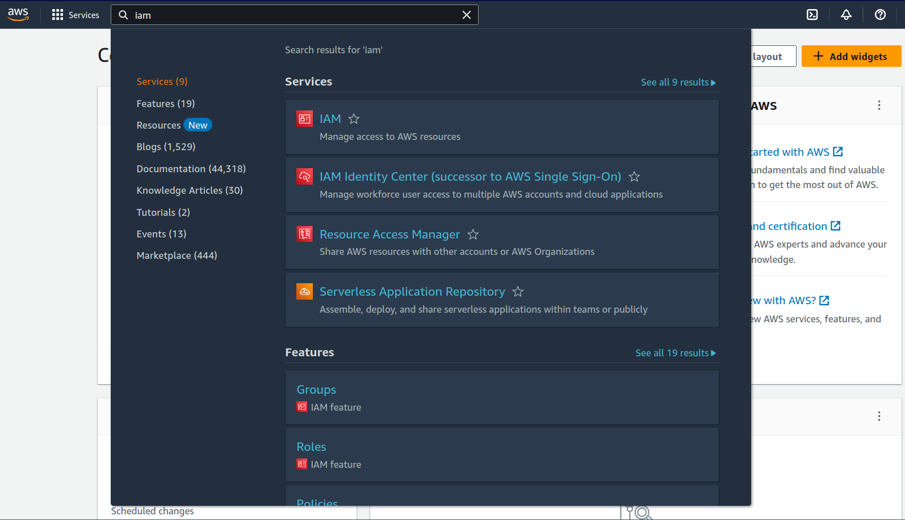
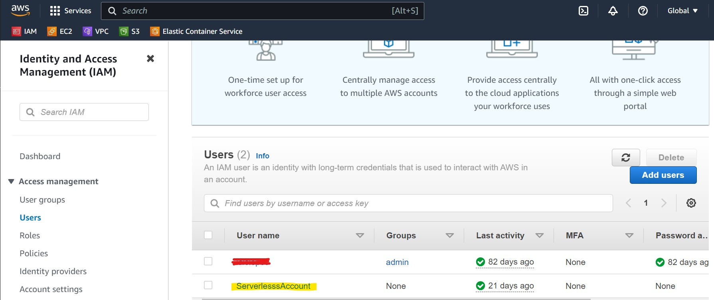
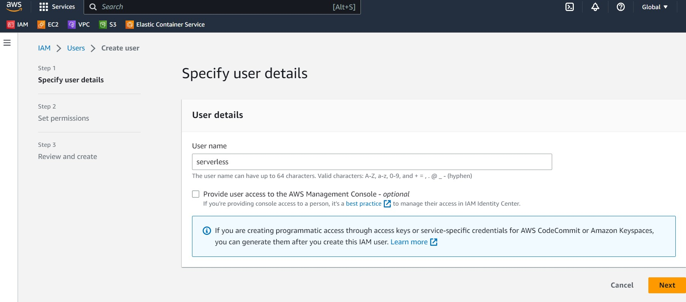
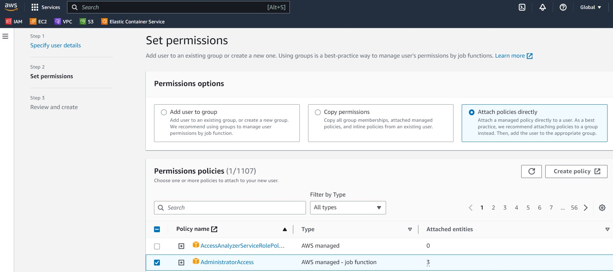
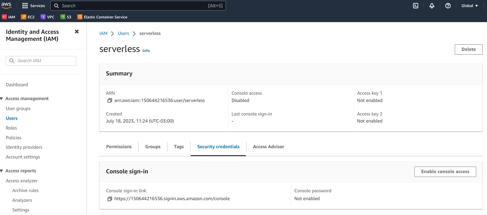
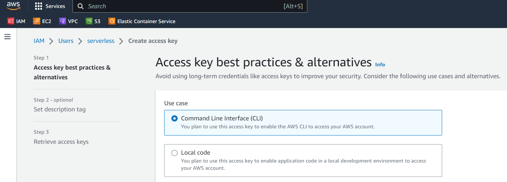
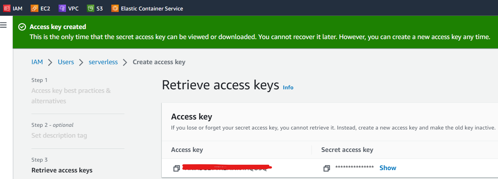
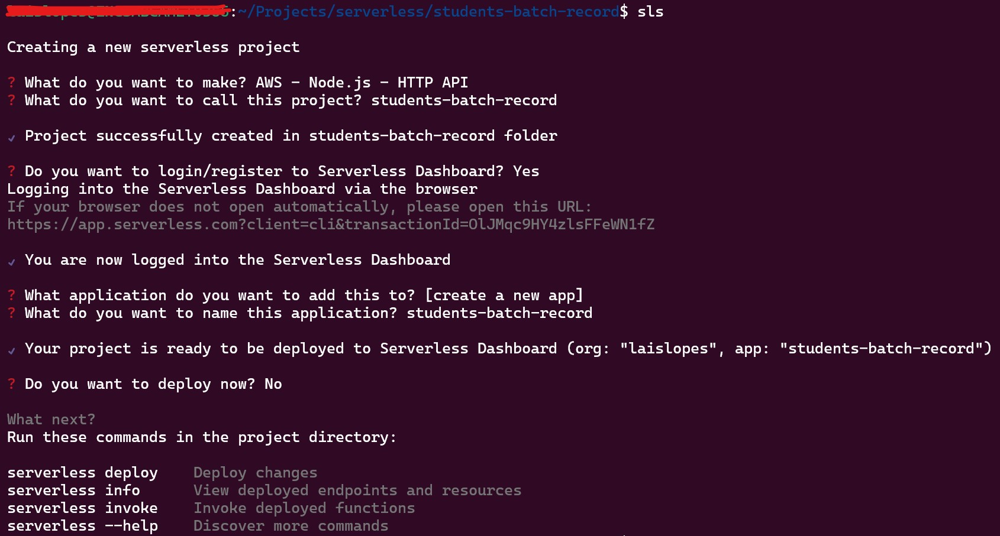
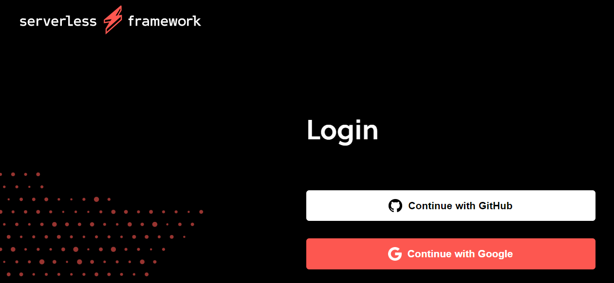

# Students Batch Record

## Requirements

- NVM or asdf (recommended)
- Node.js v18.15.0 and NPM v9.5.0
- WSL (recommended)
- Visual Studio Code (recommended)
- Active AWS Account
- aws-cli credentials

### Creating Profile and User in AWS

Before installing aws-cli, you need to have an Active AWS account.

The process steps are:

* [Subscribing in AWS](https://docs.aws.amazon.com/pt_br/cli/latest/userguide/getting-started-prereqs.html#getting-started-prereqs-signup)
* Create an IAM account
* Create an *access key* and *secret key*

Follow the steps below to create and access the keys or follow the [documentation](https://docs.aws.amazon.com/pt_br/IAM/latest/UserGuide/id_credentials_access-keys.html):

1. After create a *root* user, login in AWS console
2. Access **IAM** menu



3. Access **Users** menu
4. Click on **Add users**



5. Fill in the user name with "serverless" and click **Next**



6. On the screen **Set permissions**, select the option **Attach policies directly**, then select **AdministratorAccess** in the **Permissions policies** checkbox and click **Next**



7. Review the user information and click **Create user** to finish this step

8. After creating the user, access **Users** menu again

9. Click on the created user ("serverless") and go to **Security credentials** tab



10. Scroll down to **Access keys** section and click **Create access key**

11. On **Access key best practices & alternatives** screen, select the option **CLI**, click **Next**, and **Create acess key**


12. Copy **Access Key** and **Secret Key** to a safe temporarily place or download the .csv file



### Installing aws-cli

> **Windows users**: Remind to do all the process from `home`/`~` folder in Ubuntu/WSL terminal

Follow this [documentation](https://asdf-vm.com/guide/getting-started.html) https://docs.aws.amazon.com/pt_br/cli/latest/userguide/getting-started-install.html
to install aws-cli.

### Configuring aws-cli

On the same terminal, type `aws configure` and insert the **Access Key** and **Secret Key**, like below:

```
AWS Access Key ID [************************]: YOUR-ACCESS-KEY
```

```
AWS Secret Access Key [************************]: YOUR-SECRET-KEY
```
```
Default region name: sa-east-1
```
```
Default output format: json
```

After that, your credentials will be available on file `/home/<your-user>/.aws/credentials`

Example:

```
aws_access_key_id = YOUR-ACCESS-KEY
aws_secret_access_key = YOUR-SECRET-KEY
```

> More information about [AWS CLI Credentials](https://docs.aws.amazon.com/pt_br/cli/latest/userguide/cli-configure-files.html)

## Setup 

- `npm install`
- `npm install -g serverless@3.29.0`
- `sls -v`

#### Creatting a new Serverless Framework App


#### Logging into the Serverlerss Dashboard


#### Using Local S3 Bucket
- `sls plugin install --name serverless-offline@12.0.4`
- `sls plugin install --name serverless-s3-local@0.7.1` (Uses https://www.npmjs.com/package/s3rver in background)
- `sls offline`
- `POST http://localhost:3000/students/batch`

#### Deploy
- `sls plugin install --name serverless-disable-functions@1.0.0`

## Additional Documentation

- [WSL](https://github.com/codeedu/wsl2-docker-quickstart#dica-para-windows-11)
- [asdf](https://asdf-vm.com/guide/getting-started.html)
- [AWS Register](https://docs.aws.amazon.com/pt_br/cli/latest/userguide/getting-started-prereqs.html#getting-started-prereqs-signup).
- [Creatting IAM Account](https://docs.aws.amazon.com/pt_br/cli/latest/userguide/getting-started-prereqs.html#getting-started-prereqs-iam).
- [Access Keys](https://docs.aws.amazon.com/pt_br/cli/latest/userguide/getting-started-prereqs.html#getting-started-prereqs-keys).
